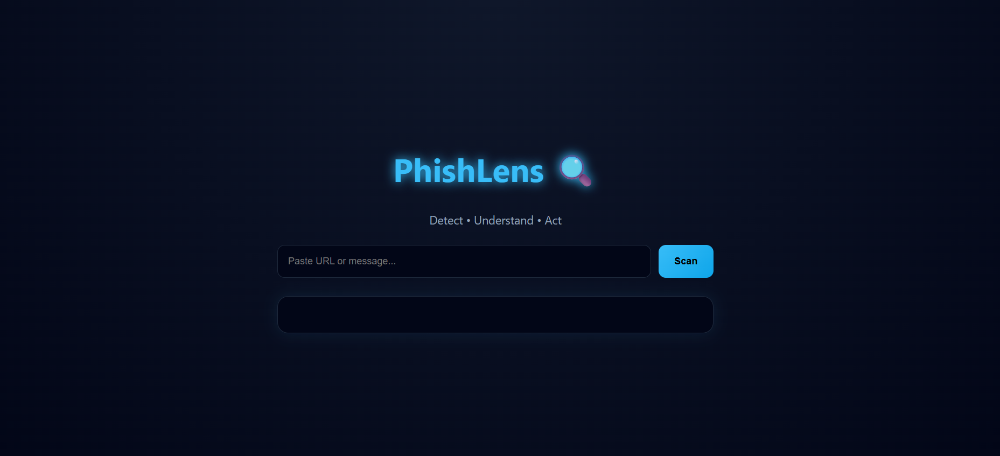
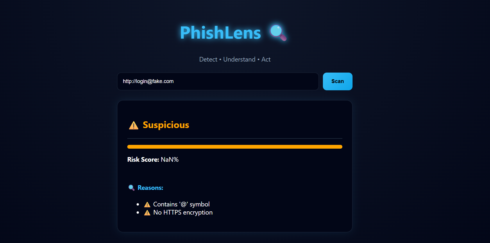
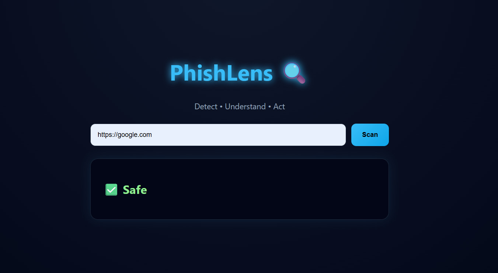
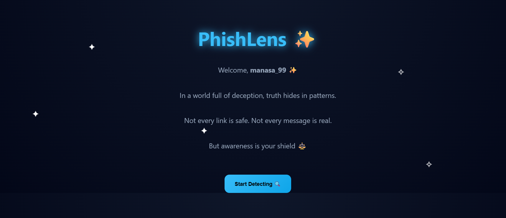

# 🎣 PhishLens

> **AI-Powered Phishing Detection with Legal Awareness** — *See through the scam before it hooks you.*


---

## 📌 Overview

**PhishLens** is a web-based AI-powered application that detects phishing messages, emails, and links — instantly and clearly.

What makes PhishLens different is that it doesn't just *detect* threats. It also **educates users about the cybercrime laws** that apply to what was found — mapping threats to real Indian legal sections like the **IT Act, 2000** and the **IPC (Indian Penal Code)**. This bridges the gap between cybersecurity awareness and legal literacy, a combination rarely found in phishing detection tools.

PhishLens focuses not just on detecting scams, but also helping users understand the legal side of cybercrime.

---

## 💭 Why I Built This

With the rise in scam messages, fake internship offers, and phishing links, I noticed that most people don't know what is actually *illegal* — or what action they can take when they're targeted.

So I built PhishLens to combine two things that should always go together:

- 🤖 **AI-based detection** — to identify the threat
- ⚖️ **Legal awareness** — to understand the rights and laws around it

The goal is not just a smart tool, but an *informative and practical* one — something that empowers users rather than just warning them.

---

## ✨ Features

| Feature | Description |
|---|---|
| 🤖 **AI-Based Detection** | Analyzes messages, emails, and URLs to classify them as Safe, Suspicious, or Phishing |
| 🔍 **Risk Level Analysis** | Assigns a clear threat level — `✅ Safe` / `⚠️ Suspicious` / `🚨 Phishing` |
| ⚖️ **Legal Awareness** | Maps detected threats to relevant Indian cybercrime laws |
| 📧 **Message & Email Analysis** | Scans raw message or email text for phishing patterns |
| 🔗 **URL Checking** | Detects malicious or deceptive links |
| ⚡ **Instant Results** | Real-time detection with clear explanations |
| 📱 **Responsive UI** | Works cleanly across desktop and mobile browsers |

---

## ⚙️ How It Works

```
User Input → AI Analysis → Risk Assessment → Legal Mapping → Final Report
```

1. **Input** — User pastes a suspicious message, email, or link
2. **AI Analysis** — The content is evaluated for phishing indicators (urgency, fake domains, deceptive language, malicious patterns)
3. **Risk Detection** — A threat level is assigned with an explanation of what triggered it
4. **Legal Mapping** — If a threat is detected, relevant Indian cybercrime laws are surfaced
5. **Result** — A clear report tells the user *what* was found, *why* it's dangerous, and *what laws apply*

---

## 🛠️ Tech Stack

| Layer | Technology |
|---|---|
| **Frontend** | HTML5, CSS3, Vanilla JavaScript |
| **AI Engine** | Claude API / Gemini API *(integration in progress)* |
| **HTTP Requests** | Fetch API |
| **Hosting** | GitHub Pages / Vercel |

> 💡 No backend server required. PhishLens runs entirely in the browser — lightweight and easy to deploy.

---

## ⚖️ Legal Awareness Module

When a phishing attempt is detected, PhishLens doesn't just warn you — it tells you **which law was broken** and what it means. This is the feature that makes PhishLens more than just a scanner.

### 📜 Applicable Laws (India)

| Law | Section | What It Covers | Penalty |
|---|---|---|---|
| 🇮🇳 IT Act, 2000 | **Section 66D** | Online fraud / cheating by impersonation using computer resources | Up to 3 years + ₹1 lakh fine |
| 🇮🇳 IT Act, 2000 | **Section 66C** | Identity theft via electronic passwords or signatures | Up to 3 years + ₹1 lakh fine |
| 📖 IPC | **Section 420** | Cheating and dishonestly inducing delivery of property | Up to 7 years imprisonment |
| 📖 IPC | **Section 419** | Cheating by personation | Up to 3 years imprisonment |

> ⚠️ *PhishLens provides general legal awareness only. For formal legal advice, please consult a qualified legal professional.*

---

## 🚀 How to Run

PhishLens is a frontend-only project — no installation needed.

```bash
# 1. Clone the repository
git clone https://github.com/manasa/PhishLens.git

# 2. Navigate into the project folder
cd PhishLens

# 3. Open index.html in your browser
#    Or use a local server:
npx live-server
```

> 🔒 **API Key Note:** If using an AI API, store your key in a config file and add it to `.gitignore`. Never commit API keys to GitHub.

---

## 🖼️ Screenshots

> *Screenshots will be added as the UI is finalized.*

### 🏠 Home Screen
<p align="center">
  
</p>

### 🚨 Phishing Detection
<p align="center">
  
</p>

### ✅ Safe Result
<p align="center">
  
</p>

### ✨ Dashboard
<p align="center">
  
</p>
---

## 🔮 Future Improvements

- [ ] 🔌 Full AI model integration (Claude / Gemini API)
- [ ] 🌐 Browser extension for real-time link scanning
- [ ] 📂 Upload `.eml` / `.msg` email files directly
- [ ] 🌍 Multi-language support (Hindi, Kannada, and other regional languages)
- [ ] 📊 Threat history and scan analytics dashboard
- [ ] 🌏 Global law mapping (GDPR, US CAN-SPAM Act, etc.)

---

## ⚠️ Disclaimer

PhishLens is built for **educational and awareness purposes**. It may not be 100% accurate and should not be used as a complete or professional security solution. Always verify suspicious content through official channels.

---

## 👩‍💻 Author

<p align="center">
  <b>Built with 🛡️ and ❤️ by Manasa</b><br/>
  <i>I’m a Computer Science student interested in AI, cybersecurity, and building real-world projects.</i>
</p>


